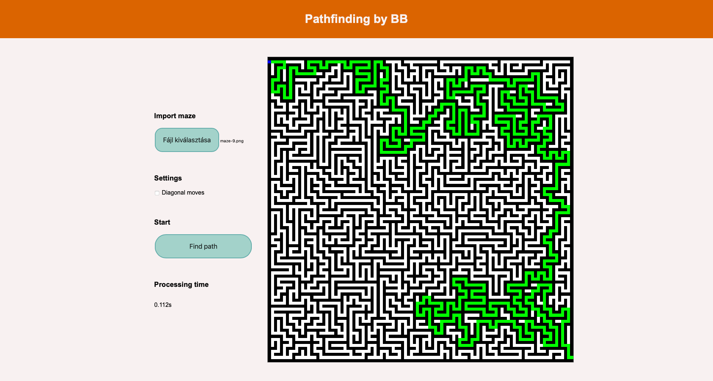

# Pathfinding Demo with Dijkstra Algorithm
This demo is designed to solve mazes [like this](./maze_example.png).
I strongly recommend using this maze generator: https://keesiemeijer.github.io/maze-generator/
# A glance at the application

## Maze file format
The file format is PNG. The suggested maze generator has a starting and ending point near the top left and bottom right corners. The maze must have white background and black walls.
## TODO
 - Error handling
 - Maximum maze size
 - Clearing the maze viewer with a button
 - Starting new session without reloading
# ISC License (ISC)
Copyright 2021 Bálint Berente

Permission to use, copy, modify, and/or distribute this software for any purpose with or without fee is hereby granted, provided that the above copyright notice and this permission notice appear in all copies.

THE SOFTWARE IS PROVIDED "AS IS" AND THE AUTHOR DISCLAIMS ALL WARRANTIES WITH REGARD TO THIS SOFTWARE INCLUDING ALL IMPLIED WARRANTIES OF MERCHANTABILITY AND FITNESS. IN NO EVENT SHALL THE AUTHOR BE LIABLE FOR ANY SPECIAL, DIRECT, INDIRECT, OR CONSEQUENTIAL DAMAGES OR ANY DAMAGES WHATSOEVER RESULTING FROM LOSS OF USE, DATA OR PROFITS, WHETHER IN AN ACTION OF CONTRACT, NEGLIGENCE OR OTHER TORTIOUS ACTION, ARISING OUT OF OR IN CONNECTION WITH THE USE OR PERFORMANCE OF THIS SOFTWARE.
